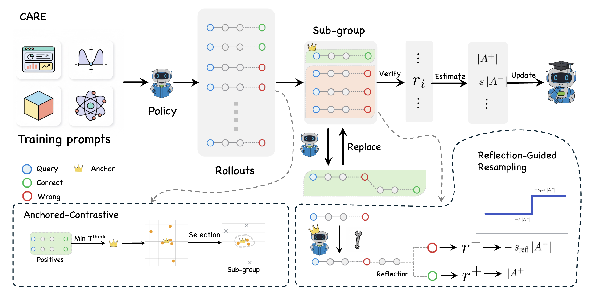

# [CVPR2026] CARE What Fails: Contrastive Anchored-REflection for Verifiable Multimodal Reasoning

📑 <a href="https://arxiv.org/abs/2512.19554">arXiv</a> | 🔎 <a href="https://www.alphaxiv.org/abs/2512.19554">AlphaXiv</a> | 🤗 <a href="https://huggingface.co/YongxinWang">Hugging Face</a>



CARE is a failure-centric post-training framework for verifiable multimodal reasoning.
Instead of discarding wrong rollouts, CARE turns close-but-wrong attempts into structured
supervision with an anchored-contrastive objective and Reflection-Guided Resampling (RGR),
while keeping single-pass inference with no test-time reflection.


## News

2026.2 Our paper is accepted by **CVPR 2026**! See you in Denver!


2026.1 Code is released.

## Highlights

- Failure-centric RLVR for multimodal reasoning: CARE explicitly learns from failed rollouts
  instead of treating them as discarded samples or uniform negatives.
- Anchored-contrastive training: pick the shortest verified-correct rollout as the anchor,
  select semantically proximate hard negatives, normalize advantages within the subgroup,
  and down-weight only negative advantages.
- Reflection-Guided Resampling (RGR): repair exactly one representative hard negative during
  training, re-verify it, and reuse the repaired rollout if it becomes correct.
- All-negative rescue: inject a small pseudo-contrast when a rollout group has no successes,
  preventing zero-signal updates.
- No extra test-time cost: CARE improves training-time credit assignment without requiring
  reflection or multi-pass decoding at inference.

## Method overview

For a multimodal prompt `x = <image(s), question>`, CARE samples a group of rollouts and
uses a programmatic verifier over the final answer and output format to build a
failure-aware learning signal:

1. Sample a group of rollouts (size G).
2. Verify each rollout with a programmatic verifier.
3. If at least one rollout is correct:
   - Choose the anchor as the shortest verified-correct rollout.
   - Select hard negatives that are closest to the anchor in rationale space via cosine proximity.
   - Normalize rewards only inside the selected subgroup and down-weight only the negative advantages.
   - If fewer than the target number of hard negatives are available, rescale the update size to keep training stable.
4. During training, optionally run RGR on one representative hard negative:
   - Insert a short repair cue.
   - Resample once.
   - Replace the original failure if the repaired rollout becomes verifier-positive; otherwise keep it with a reduced penalty.
5. If all rollouts are incorrect:
   - Apply an all-negative rescue with a small pseudo-contrast so gradients do not stall.
6. Use a region-weighted policy objective:
   - Answer tokens receive full weight.
   - Positive rationale tokens receive a small weight.
   - Failing rationale tokens are masked out.

CARE changes how training signals are formed from rollouts, but keeps the verifier and
single-decode inference pipeline unchanged.

---

## Benchmark snapshot

According to the paper, CARE delivers consistent gains over existing RLVR baselines:

- On **Qwen2.5-VL-7B**, CARE improves macro-averaged accuracy by **+4.6 points over GRPO**
  across six verifiable visual-reasoning benchmarks.
- On **Qwen3-VL-8B**, CARE reaches competitive or state-of-the-art results on
  **MathVista mini** and **MMMU-Pro** under the same evaluation protocol.
- The paper attributes most of the gains to the anchored-contrastive objective, with RGR
  providing an additional improvement by converting near-miss failures into usable positives.

---

## Repository map

- CARE subgrouping + advantages: `verl/algorithms/adv_estimators/care.py`
- Cosine hard negatives: `verl/algorithms/neg_selectors/cosine_hardneg.py`
- Region-weighted token advantages: `verl/algorithms/losses/region_weighted_tokens.py`
- RGR hook (training-only): `verl/hooks/rgr.py`
- Tag parsing for <think>/<answer>: `verl/utils/response_tags.py`
- Config surface: `examples/config.yaml` (`care.*`, `rgr.*`)
- Qwen2.5-VL CARE script: `examples/qwen2_5_vl_7b_geo3k_care_grpo.sh`

---

## Installation

```bash
git clone https://github.com/yongxinwang-ai/CARE.git
cd CARE

# (recommended) create env
conda create -n care python=3.10 -y
conda activate care

pip install -e .
```

---

## Quickstart

### CARE (Qwen2.5-VL 7B, Geometry3K)

```bash
bash examples/qwen2_5_vl_7b_geo3k_care_grpo.sh
```

### CARE with overrides

```bash
python3 -m verl.trainer.main \
  config=examples/config.yaml \
  data.train_files=hiyouga/geometry3k@train \
  data.val_files=hiyouga/geometry3k@test \
  worker.actor.model.model_path=Qwen/Qwen2.5-VL-7B-Instruct \
  algorithm.grpo_variant=care \
  care.K=4 care.M=6 \
  care.neg_scale_s=0.5 care.equalize=true \
  care.rescue.enable=true care.rescue.delta=0.1 \
  care.token_weighting=region_weighted care.gamma_pos=0.005 \
  rgr.enable=true rgr.template=structured
```

---

## CARE configuration

CARE is exposed via `algorithm.grpo_variant=care` and the `care.*` / `rgr.*` sections in
`examples/config.yaml`. The provided Geometry3K example script uses:

- Rollouts per prompt: G = worker.rollout.n (default 8 in examples)
- Hard-negative subgroup size: care.K = 4
- Negative preselect size: care.M = 6
- Negative scaling: care.neg_scale_s = 0.5
- Reflected-failure scaling: rgr.s_refl = care.neg_scale_s / 2 (if not set)
- All-negative rescue magnitude: care.rescue.delta = 0.1
- Positive rationale token weight (region-weighting): care.gamma_pos = 0.005


---

## Citation

If you use this code, please cite the paper. The arXiv entry is:

```bibtex
@article{wang2025care,
  title   = {CARE What Fails: Contrastive Anchored-REflection for Verifiable Multimodal Reasoning},
  author  = {Wang, Yongxin and Yang, Zhicheng and Cao, Meng and Han, Mingfei and Lin, Haokun and Zhu, Yingying and Chang, Xiaojun and Liang, Xiaodan},
  journal = {arXiv preprint arXiv:2512.19554},
  year    = {2025}
}
```

---

## License

Apache-2.0. See `LICENSE`.
